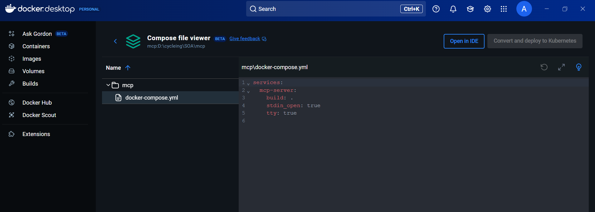
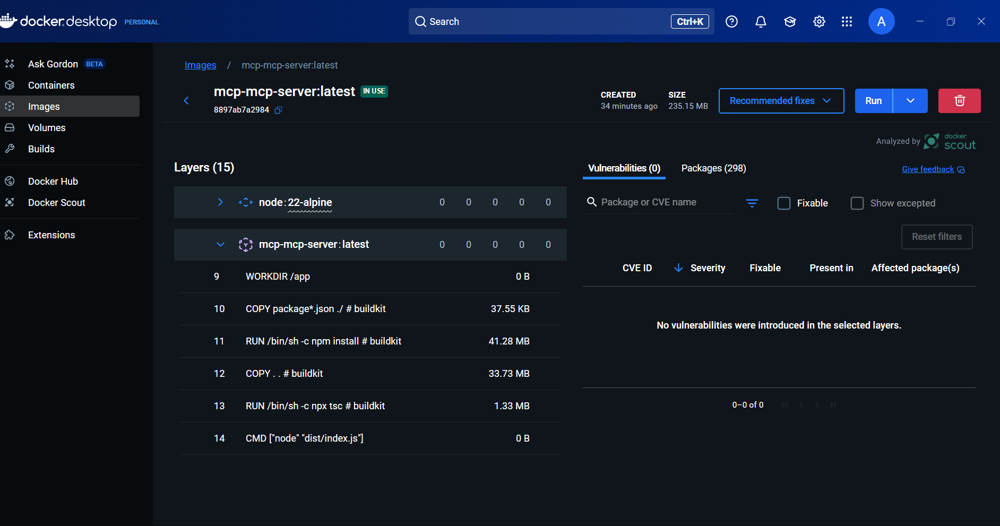
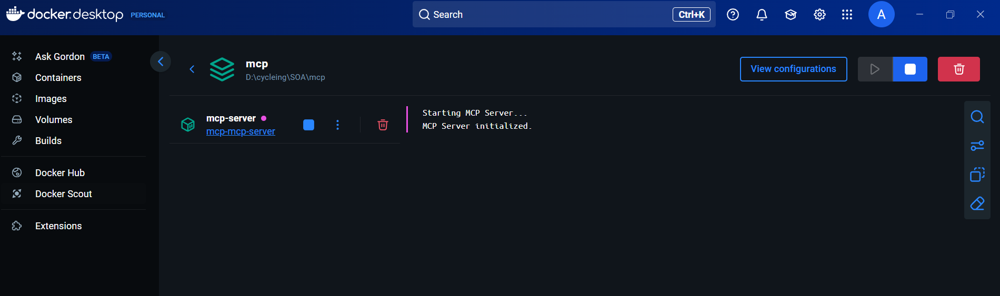

# MCP Server

This project demonstrates a Model Context Protocol (MCP) server implemented in TypeScript. The server uses the STDIO transport for communication and provides tools and resources for dynamic interactions.

## Objectives

- Discover the MCP SDK in TypeScript.
- Implement tools and resources.
- Use the STDIO transport to communicate via JSON.
- Containerize the server for deployment.

## Prerequisites

- Node.js & npm (v22+).
- Docker & Docker Compose.

## Project Structure

- `src/index.ts`: Main server implementation.
- `Dockerfile`: Docker configuration for containerizing the server.
- `docker-compose.yml`: Docker Compose configuration for service orchestration.
- `package.json`: Project dependencies and scripts.
- `tsconfig.json`: TypeScript configuration.

## Setup Instructions

### Step 1: Initialize the Project

1. Install dependencies:
   ```bash
   npm install
   ```

2. Build the project:
   ```bash
   npm run build
   ```

3. Start the server:
   ```bash
   npm start
   ```

### Step 2: Containerization

1. Build and start the Docker container:
   ```bash
   docker-compose up --build
   ```

2. Test the `add` tool:
   ```bash
   echo '{"id":1,"tool":"add","args":{"a":5,"b":7}}' | docker-compose exec -T mcp-server node dist/index.js
   ```

3. Test the `greeting` resource:
   ```bash
   echo '{"id":2,"resource":"greeting://Alice","list":null}' | docker-compose exec -T mcp-server node dist/index.js
   ```

## Deliverables

- Git repository containing:
  - `src/`
  - `Dockerfile`
  - `docker-compose.yml`
  - `package.json`
  - `tsconfig.json`
- Screenshot of STDIO exchanges showing results.

## Screenshots

### Docker Desktop Showing Running Container


### Docker Compose File Viewer


### Docker Image Layers


## License

This project is licensed under the ISC License.
